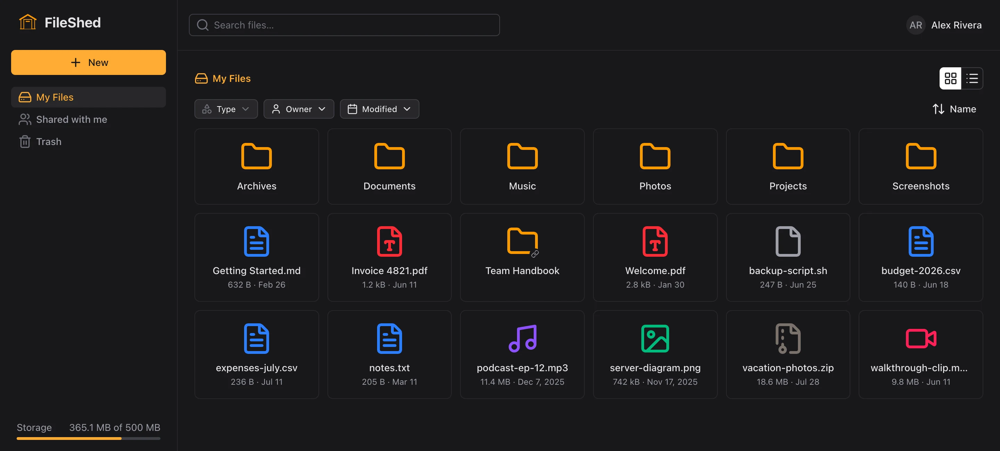
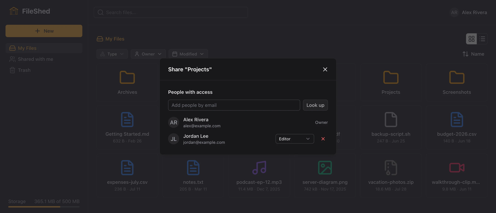
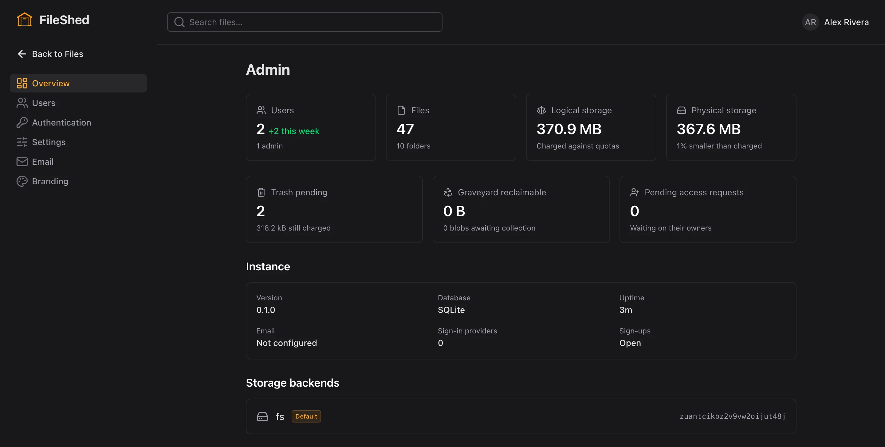

<p align="center">
  
</p>

<h1 align="center">FileShed</h1>

<p align="center">
  Self-hosted, multi-user file hosting — inspired by cloud file management tools like Dropbox or Google Drive.
</p>

<p align="center">
  <a href="https://github.com/fileshed/fileshed/actions/workflows/ci.yml"></a>
  <a href="LICENSE"></a>
</p>

---



Run it on your own box and it is your file server, with accounts, shared folders, and permissions that behave the
way you expect. The web UI does not feel like a compromise for having been self-hosted.

<p align="center">
  
  
</p>

## What it does

- **Content-addressed storage.** Every blob is keyed by its SHA-256, so identical bytes are stored once no matter how
  many people upload them or where they land. Files are hashed in the browser before anything is sent, which means a
  file the instance already holds uploads instantly.
- **Files on disk.** Blobs live on the local filesystem, laid out by hash. The storage layer sits behind a single
  interface so other backends can slot in later, but nothing else is implemented yet.
- **Shared folders that are actually folders.** Share a folder as viewer or editor; editors can add files and create
  subfolders inside it. Recipients place what is shared with them anywhere in their own tree rather than in a separate
  "shared" bucket.
- **Public links.** Per file, set to download or to render inline. Inline links are hotlinkable, which is what you
  want for images.
- **Per-user quotas.** Charged by file ownership, with an instance-wide default and per-user overrides. A file you own
  counts against you wherever it sits.
- **Trash with retention.** Deletes are recoverable until the retention window the admin sets expires.
- **Viewers and editors in the browser.** Audio and video playback, PDF viewing with annotation, and text and Markdown
  editors with autosave.
- **Search.** Name matching across everything you can see, with filters for type, owner, and modified date.
- **An admin area.** Users and quotas, outgoing mail, OAuth sign-in providers, branding and theming, and instance
  settings, most of which apply live without a restart.
- **Narrow screens.** The interface works down to 360px wide.

## Quickstart

Node 24 or newer. Node runs TypeScript natively, so there is no build step to fight with.

```bash
git clone https://github.com/fileshed/fileshed.git
cd fileshed
npm install
cp .env.sample .env      # then edit HOST / PORT / LAUNCH_EDITOR to taste
npm run dev              # Vite client dev server, API running in-process
```

That serves the whole app on one port with hot reload. On first run, visit `/setup`. The server prints a setup code
to its log, and the account you create there becomes the instance admin.

### Deploying

Images are published to the GitHub Container Registry for `linux/amd64` and `linux/arm64`:

```bash
docker run -d --name fileshed \
  -p 3000:3000 \
  -e AUTH_SECRET="$(openssl rand -base64 32)" \
  -e BASE_URL=http://localhost:3000 \
  -v fileshed-data:/data \
  ghcr.io/fileshed/fileshed:latest
```

One volume holds everything that persists: the SQLite database at `/data/fileshed.db` and the blob store under
`/data/blobs`. `docker logs fileshed` prints the one-time setup code for the first admin account.

Three moving tags are published alongside the exact version of every release:

- `latest` — the newest stable release.
- `beta` — the newest prerelease.
- `dev` — the newest commit on `main` that passed the full test suite.

See **[docs/deployment.md](docs/deployment.md)** for compose files, the environment reference, HTTPS guidance,
Postgres, and what to back up.

## Stack

The server is [Hono](https://hono.dev) on Node, with [Kysely](https://kysely.dev) as the single query builder across
both supported databases. Postgres is the primary target and SQLite the convenience deployment, and feature parity
between them is a hard requirement. Authentication is [BetterAuth](https://better-auth.com), where OAuth providers are
configuration rather than code. The client is Vue 3 with [Nuxt UI](https://ui.nuxt.com) on Tailwind, though the
file-management surface itself (grid, selection, drag and drop, upload manager) is custom. Domain types are
hand-written TypeScript with Zod codecs at every boundary, so a drifted codec fails the build instead of failing
quietly at runtime.

It is an npm workspaces monorepo:

- `packages/core` — `@fileshed/core`, the shared domain vocabulary and API contract
- `src/server` — `@fileshed/server`, the Hono API
- `src/client` — `@fileshed/client`, the Vue frontend

## Status

Pre-1.0. The feature list above is what works today; interfaces and schemas are still fair game to change, and there
is no upgrade-compatibility promise yet. Run it and file bugs, but expect some edges.

**[docs/roadmap.md](docs/roadmap.md)** tracks what is done and what is planned. `docs/design/requirements.md` is the
source of truth for scope and the technical decisions behind it.

## Contributing

Contributions are welcome: bugs, fixes, features, docs. Start with **[CONTRIBUTING.md](CONTRIBUTING.md)**, which
covers the four checks every change has to pass (`lint`, `lint:types`, `test`, `test:e2e`) and the project's
spec-first approach to tests.

Contributions need a one-time Contributor License Agreement, and signing it is a one-line comment: open your first
pull request, reply to the bot, and every pull request after that is covered. You keep your copyright; the CLA is a
license, not an assignment. The details, including what the project gets out of it, are in
[CONTRIBUTING.md](CONTRIBUTING.md) and [.github/CLA.md](.github/CLA.md).

## License

[GNU Affero General Public License v3.0](LICENSE) (`AGPL-3.0-only`). Everything released under it stays under it,
permanently. Nobody, including the project owner, can pull a published release back out of free software.
